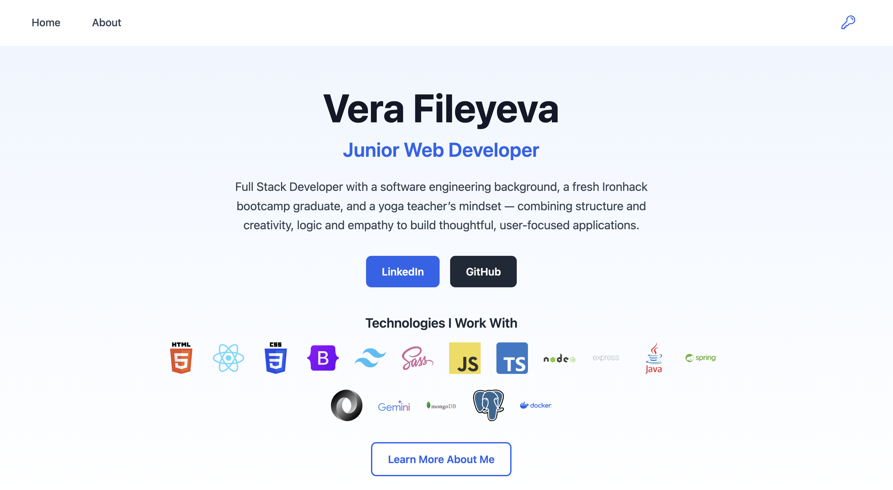
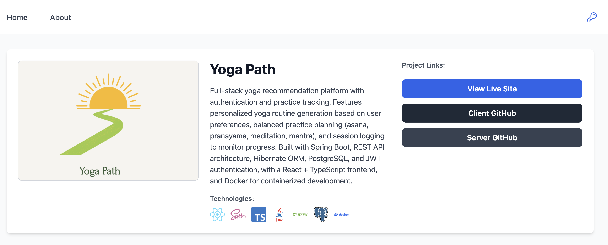
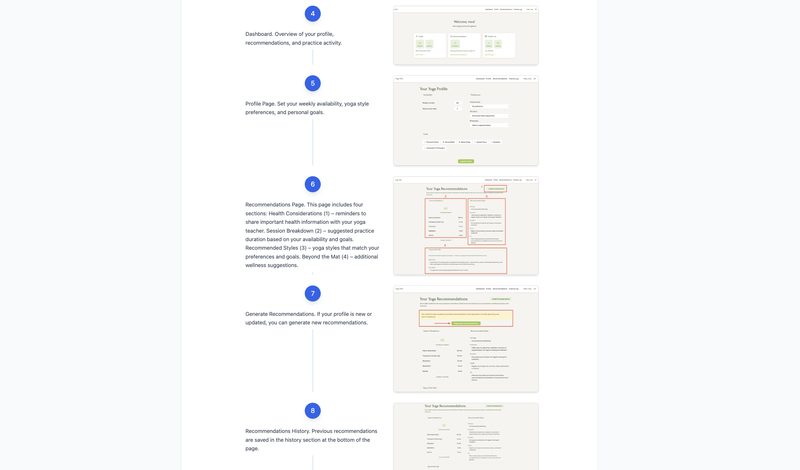

# Portfolio — Client

The frontend of **[veramei.dev](https://veramei.dev/)** — a portfolio site that showcases my current work, the technologies I use, and the projects I've built.

The portfolio is itself a learning project: this is where I explored TypeScript on the server side, Docker, CI/CD pipelines, Tailwind CSS, and PostgreSQL. It also runs as a **single-admin** system — only I can sign in and edit content directly from the live site — and includes a **manuals** feature so hiring managers (and anyone else) can browse a project's features and screens without having to run it themselves.

## Screenshots

<p align="center">
  
</p>

<p align="center">
  
  
</p>

## Features

- Public portfolio with project list, project details, and a curated technologies section
- Per-project **manuals** — step-by-step walkthroughs with screenshots, so visitors can review features without running the projects
- Single-admin authentication — JWT-protected routes for adding and editing content from the live site
- Responsive design with Tailwind CSS
- Client-side routing with React Router 7

## Tech stack

- React 19
- React Router 7
- Tailwind CSS
- Axios
- Create React App (build tooling — migration to Vite planned)

## Project structure

```
src/
├── components/     # Reusable UI (Navbar, Loading, IsPrivate, IsAnon)
├── context/        # AuthContext — JWT state + verify on load
├── pages/          # Route-level components (Home, Login, Profile, NotFound, ...)
├── services/       # Axios clients for the API
└── App.jsx         # Router setup
```

## Getting started

### Prerequisites

- Node.js 20+
- The [server](https://github.com/VeraV/portfolio-server) running locally on port 5005 (or pointed at a deployed instance)

### Setup

```bash
git clone git@github.com:VeraV/portfolio-client.git
cd portfolio/client
npm install
```

### Environment variables

Create a `.env` file in `client/`:

```
REACT_APP_SERVER_URL=http://localhost:5005
```

### Run

```bash
npm start
```

Opens [http://localhost:3000](http://localhost:3000).

## Available scripts

| Command         | Description                                                      |
| --------------- | ---------------------------------------------------------------- |
| `npm start`     | Development server with hot reload                               |
| `npm test`      | Run tests in watch mode                                          |
| `npm run build` | Production build (includes `_redirects` for Netlify SPA routing) |

## Known vulnerabilities

`npm audit` reports vulnerabilities in `react-scripts`' transitive dependencies (build and test tooling — not shipped to production). These cannot be fixed without breaking changes, as Create React App is no longer maintained.

Planned: migration to Vite, which will resolve these automatically.

## Related

- [Server](https://github.com/VeraV/portfolio-server) — Express + Prisma + PostgreSQL backend
- [Tests](https://github.com/VeraV/portfolio-tests) — Playwright E2E test suite
